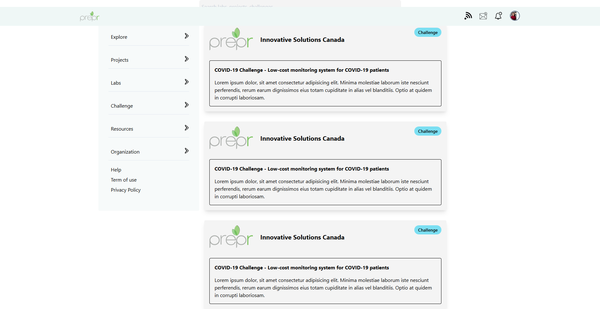

# Front-end Challenge

## About this project

The project is a challenge of preprlabs.org. The project will improve user experience when the user visit preprlabs.org.

## How to improve?

Using Figma to redesign the sites, so you can visit the design at [here](https://www.figma.com/file/9A0sRvNtaN2AgVqV0BVr6d/Prepr?node-id=5%3A0)

# Technology Stack

React and Tailwind

I'm learning Tailwind to do this project. Tailwind is so cool

I deployed it to zeit.co. So you can visit it at [here](https://front-end-eosin.now.sh/): https://front-end-eosin.now.sh/

# My Thought

I'm overwhelming with a lot of things at school. So, I decided to finish right here. The rest of challenge may be done by other candidates. Good luck guys.
